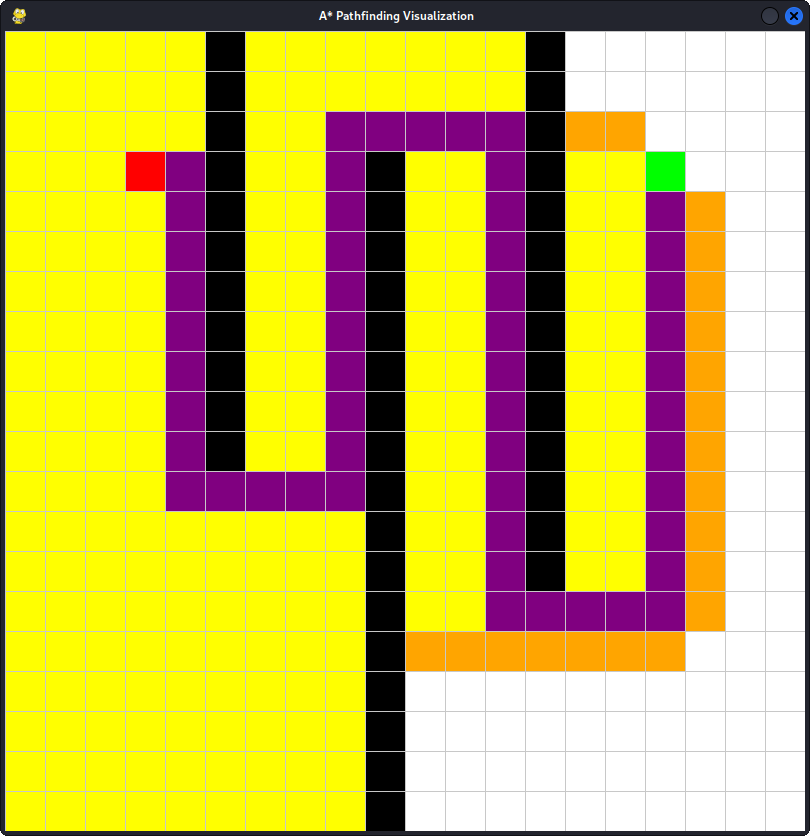

# A* Pathfinding

A simple implementation of the A* pathfinding algorithm with a visual interface. This project demonstrates how A* efficiently finds the shortest path between two points on a grid, avoiding obstacles.



## Requirements

- Python 3.7+
- `pygame` library

Install dependencies with:

```bash
pip install pygame
```

## Usage

1. Clone the repository:
    ```bash
    git clone https://github.com/PrzemyslawBanasiak13/a_star_pathfinding.git
    cd a_star_pathfinding
    ```
2. Run the application:
    ```bash
    python main.py
    ```

## Keybindings

- **Left Click:** Place start, end, or obstacles on the grid
- **Right Click:** Remove a node (start, end, or obstacle)
- **Spacebar:** Start the A* algorithm
- **C:** Clear the grid
